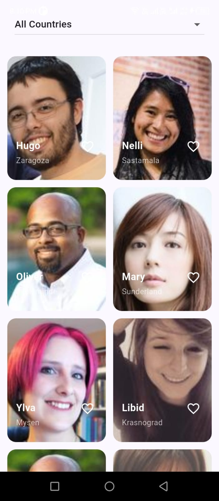

# Profile Explorer

A Flutter-based app to explore user profiles, view details, and like profiles. Supports responsive layout, offline detection, and smooth Hero animations between screens.

---

## Features

- **Grid of Profile Cards**  
  Display a scrollable grid of user profiles with name, city, and profile picture.

- **Profile Details Screen**  
  Tap on a profile to view full details, including age, city, and country.

- **Hero Animations**  
  Smooth transition animations for profile pictures between the grid and detail screen.

- **Responsive Design**  
  Layout adapts to different screen sizes and orientations.

- **Like Button**  
  Tap to like/unlike a profile with animated heart effect.

- **Offline Handling**  
  Detects network connectivity and shows a Wi-Fi off overlay when offline.

- **Country Filter**  
  Filter profiles by country using a dropdown.

- **Pull to Refresh**  
  Refresh the profile list via swipe-down gesture.

---

## Screenshots

  

> Add actual screenshots of your app here.

---
## Folder Structur

lib/
│
├── data/
│   ├── models/
│   ├── repositories/
│   ├── services/
│
├── presentation/
│   ├── providers/
│   ├── screens/
│   │   ├── home/
│   │   └── detail/
│   ├── widgets/
│
└── main.dart
---

## Getting Started

### Prerequisites

- Flutter SDK ≥ 3.0
- Dart ≥ 3.0
- Android Studio / VS Code (or your preferred IDE)

### Installation

1. Clone the repository:
git clone https://github.com/Abhi9085/profile_explorer.git

2. Navigate to the project folder:
cd profile_explorer

3. Install dependencies:
flutter pub get

4. Run the app:
flutter run

## State Management:

- Provider: Used for managing user list, likes, selected country filter, and connectivity status.

## Connectivity Handling:

- Uses ConnectivityProvider to detect internet connectivity.

- Shows a semi-transparent overlay with a Wi-Fi off icon when offline.

## Hero Animations:

- Profile pictures use unique Hero tags for smooth transitions between the Home and Detail screens.

- Unique tag format: 'profile_<user.id>'.

## Notes:

- Data is fetched from a remote API or a mock data source (depending on your setup).

- The app supports pull-to-refresh and filtering without requiring a restart.

